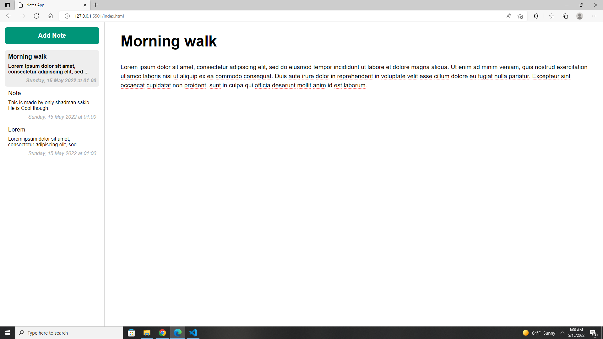

# Notes App Using Vanilla JS and Local Storage    
    
  

 

I used Html, Css, Sass, Vanilla js, Local Storage to build the project.
 

### Author Links  

👋 Hello,I am Shadman and I am a Full Stack Web developer  

🚀 Follow me:  

  - [Github](https://github.com/sakibshadman19)
  - [LinkedIn](https://www.linkedin.com/in/shadman-sakib-95462923a/)
  - [Facebook](https://www.facebook.com/shadman.sakibtanmoy)
  

<!-- all link is here -->

